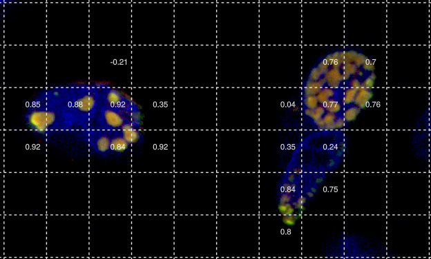
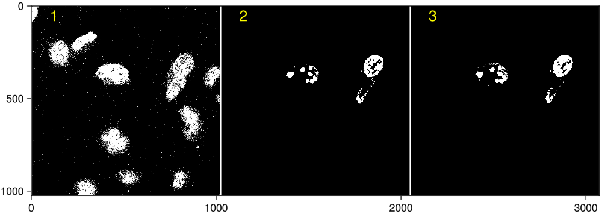
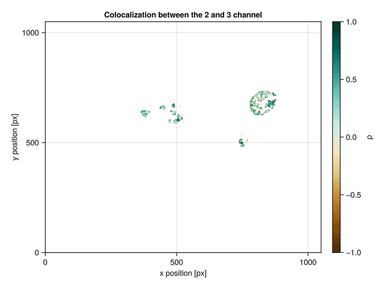
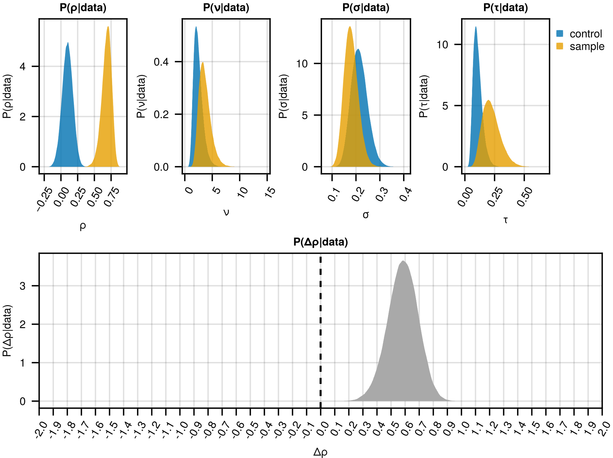
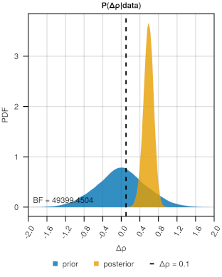
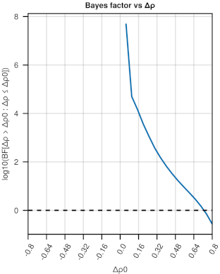

```@meta
CurrentModule = ProteinCoLoc
```

# Functions to plot results

## Plot correlation of each image patch
The plotting method plots the merged `MultiChannelimage` an displays the computed correlation metric for each image patch. The correlation mechanism are chosen based on the `cor_method`argument: 
- `:pearson`: Pearson correlation coefficient (PCC)
- `:spearman`: Spearman's rank correlation coefficient
- `:kendall`: Kendall rank correlation coefficient

If `scale_channels` is set to true, the pixel intensities are scaled to a range between 0 and 1 using min-max scaling. 



```@docs
plot(
    img::MultiChannelImage,
    num_patches::T,
    cor_channel::Vector{T} = [2, 3];
    scale_channels::Bool = true,
    file::String = "test.png";
    channel_for_plot::Vector{T} = [1, 2, 3],
    save_to_file::Bool = true,
    cor_method::Symbol = :pearson
    ) where {T <: Int}
```

## Plot mask
As explained in our [paper](https://doi.org/10.1038/s41598-024-63884-1), we use Otsu thresholding to compute a mask. This mask can be visualised using the function `plot_mask(img::MultiChannelImage, file::String)`. In these images all masked pixels are depicted black and non-masked pixels that are included in the analysis are white.



```@docs
plot_mask
```

## Plot local correlation plot

The local correlation plot allows for the visualisation of local colocalization patterns at a finer spatial scale and enables visualising variations in colocalization intensity within small image patches (ideally between 10 and 100 px). Robust estimates for individual patches are ensured by performing a correlation between intensities only if 15 or more pixels in a patch have intensities above Otsu’s threshold for both channels. If the chosen number of patches is too high, the number of patches is dynamically adjusted until at least 15 pixels in a patch have non-masked intensities. 



```@docs
local_correlation_plot
```
## Plot posterior distribution
The `plot_posterior(posterior)` function enables the visualisation of the posterior distribution for all global model parameters under both the control and sample conditions. Additionally, it plots the posterior distribution $P(\Delta \rho | data)$, which represents the difference in the correlation metric $\rho$.



```@docs
plot_posterior
```

## Bayes Plot
The `bayesplot(prior, posterior)` function enables the visualisation of the prior distribution $P(\Delta \rho)$ and the posterior distribution $P(\Delta \rho | data)$,which represents the difference in the correlation metric $\rho$ before and after seeing the data. Additionally, it displays the Bayes Factor for the hypothesis $H_1: \Delta \rho > \Delta \rho_0$ compared to the null hypothesis $H_0: \Delta \rho \leq \Delta \rho_0$. The Bayes Factor at threshold $\Delta \rho_0$ can be provided as an argument to the function if it has been already computed using the function [`compute_BayesFactor`](@ref). If the argument `bf` is not specified it will be computed automatically. 



```@docs
bayesplot
```

## Bayes Factor range plot
The selection of the threshold $\Delta \rho$ is a difficult task and quite subjective. Therefore, we provide the function `bayes_rangeplot`that visualises the Bayes Factor for the hypothesis $H_1: \Delta \rho > \Delta \rho_0$ compared to the null hypothesis $H_0: \Delta \rho \leq \Delta \rho_0$ for different values of $\Delta \rho$. The horizontal dashed lined depicts a Bayes Factor of 1.
The values of $\Delta \rho$ for which the Bayes Factor should be computed are determined by the `Δρ::Vector{T} where T<: AbstractFloat` and defaults to a range between -0.5 and 0.5 at a step size of 0.05. 



```@docs
bayes_rangeplot
```

## Helper functions

```@docs
minmax_norm!
```

```@docs
cm_to_px
```

```@docs
calculate_font_size
```

## List of defined functions and methods

```@index
```
